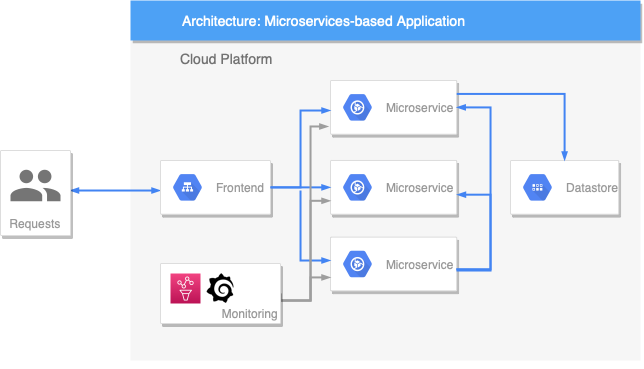

# [AGISIT 24/25](https://fenix.tecnico.ulisboa.pt/disciplinas/AGI11/2024-2025/1-semestre)

# Capstone Project Specification

## Introduction
The Capstone Project will provide a hands-on lab environment that will allow to validate the skills and knowledge you have learned. 
It corresponds to 50% of the course’s final grade.

The Project is sized to be developed by a team of (preferably) 3 students.

The objective, although simple, corresponds to a **realistic** example on how to deploy and provision a tiered (frontend, backend) **Microservices-based** containerized Web Application on a Public Cloud provider, such as **Google Cloud Platform** (GCP) or **Amazon Web Services** (AWS). The project entails the use of automation tools such as **Terraform**, **Ansible**, **Pulumi**, as well as the instrumententation of applications, services and infrastructure components to monitor and log application behavior using tools such as **Prometheus**, **Fluentd**, **Grafana**, etc.

The Architecture of the base solution should consist of the following main services:

- **Frontend**: the entry point (ingress) that exposes an HTTP server (serving the Web site);
- **Backend services**: provide the desired functionalities;
- **ObjectStore/Cache/Database**: data storage;
- **Monitoring Server**: provides insight over the system.

The following figure depicts a typical application architecture.

## Implementation

The solution should correspond to a simple but functional system. It is up to each team to decide how and where (e.g., in which cloud provider) to implement and deploy the solution. The solution should be easily reproducible, i.e., each team must include deployment instructions in the respective project report, so that anyone following those instructions is able to deploy the system (avoiding, as much as possible, vendor lock-in situations). The project implementation can be divided into two main stages:

- Stage I: a base solution consisting of a functional system without enhancements;
- Stage II: an enhanced solution with the addition of components or deployments method to provide advanced features.

## Base Solution

The Base solution has a **weight of 70%** on the evaluation of the implemented project and can be achieved following the steps described below. The recommended implementation strategy involves the following steps:

- **Step 1**: Building a simple Web Application using a Microservices-based architecture. You can use an open source application (see some examples below) as a starting point or develop one of your own;
- **Step 2**: Deploying the required foundational resources on a public cloud of choice;
- **Step 3**: Building the Infrastructure using a generic toolchain for deploying the containerized application and/or necessary cloud services, using a fully automated, Infrastructure as Code (IaC) approach;
- **Step 4**: Deploying the Operations tooling that will allow basic traceability and performance monitoring of the solution. For that, you will need to have configured the application (and other resources) to expose some metrics in order to show their health and status, and then deploy a monitoring server using, for example Prometheus, and create a Dashboard (e.g., using Grafana) to display the metrics in real-time.

You have to update the project's code repository regularly as this will help us understand the distribution of work among the team members and the various stages of development. Each team member must update their group's repository as they complete the various tasks assigned to them. Failure to do so may lead to grading penalties.

# Advanced Components or Deployments Methods

The advanced components for the solution either provide additional features or correspond to different deployment methods. The implementation of these features has a **weight of 30%** on the evaluation of the implemented Project. The top evaluation of the Project can be reached by the following options to the solution (chose one):

- **1**. Create and run a **Continuous Integration** (CI) / **Continuous Deployment** (CD) pipeline for the Web Microservices-based Application, using for example **Jenkins**, in order to test, package and deploy the application;
- **2**. Deploy the Web Microservices-based Application, with **high availability**, which requires load balancing and a database backend service with persistent storage;
- **3**. Use **orchestration tools** such as **Docker Swarm** or **Kubernetes**, to automatically **deploy**, **scale**, have adequate networking (i.e., a Service Mesh ensuring a streamlined communication process in between the microservices), and restart services in case they are stopped.

# Deliverables and deadline

After finalizing your project, you need to prepare documentation on it (deliverables) and submit it for evaluation. There is only one submission for each group, produced collaboratively, and needs to be submitted by just one member of the group.

**The deadline for this submission is Friday, October 25th, 2024, by 11h59 pm.**

The deliverables to submit (to the specified platform) are the following:

- **Fenix**: a Report describing the Project, including the architecture of the solution, the components, the tools used for the deployment;
- **Gitlab**: the last commit of the project pushed to the group Git repository, `https://gitlab.rnl.tecnico.ulisboa.pt/agisit/agisit24-gN`, where `N` represents your group number;
- **Youtube**: a short video showing the deployments steps of the solution until being running in production and demonstrating its behavior.

### Project Report

The Report must be a PDF file submitted to **Fenix**. The name of the file **must** be `project-gN.pdf`, where `N` represents your group number. The report's format is flexible and to your liking, although the following guidelines should be taken into account:

- The number and name of each active member of the group should be included (this is to double check the composition of the groups, since sometimes there are changes that are not reflected in Fenix);
- The report is written in English;
- The link to the video must be provided in the beginning (e.g., in the Introduction);
- The report should include figures or diagrams, for example the Architecture of the solution, which can be produced using for example the Diagrams.net tool;
- The content of the report should include: i) an Introduction explaining the context of the project, ii) the System Design and Architecture corresponding to the base system, iii) Advanced Components or Deployment Methods correspondoing to your advanced features, and iv) an Evaluation section that includes a throughput and latency study of the system as the number of clients generating requests increases;
- The report should be limited to 5 pages using Times New Roman, Arial or similar, at least font size 10, margin sizes (2.0 cm side and 1.5 cm top and bottom), and single line spacing. 

If you are looking for a report template, [LNCS](https://www.springer.com/gp/computer-science/lncs/conference-proceedings-guidelines).

### Source code

The source code of the project should be submitted to the team repository presented above and contain all files and directories necessary for reproducing the experiment, including instructional READMEs, screenshots and diagrams illustrating the architecture, the steps, the procedures, and application usage (including screenshots of the Web UI), etc.

A `README.md` in the root directory should contain:

- a brief description of the application and of the solution and its components;
- instructions for installing and configuring the entire system so that it can be setup in fully operational conditions.

### Video

The video can be structured in any way. It can be an interactive tour, a demo, a slideshow with voice overlay, etc. It constitutes an opportunity to better explain how the application was developed, how it is implemented, the main hurdles encountered, and above all to demonstrate that it works!

The requirements for the video are:

- should be done in collaboration by all the members, not just one:
- should be released on **YouTube**;
- should be public (or unlisted, if students are not comfortable with showing it to the world);
- the link to the video **must** be provided in the beginning of the Project Report; (e.g., in the Introduction);
- the duration should not exceed 10 minutes;
- The resolution should be at least HD-720p (1280x720);
- Its quality can be assessed by the degree to which the application, its architecture, implementation, configuration, etc., the viewer is able to understand the work done and by how successfully it demonstrates that the application actually works.

## Examples of open-source applications

The following examples are given as inspiration material. Some of these examples are used as demonstrators or sandboxes for the technologies and/or tools used for the build and deployment of microservice-based applications, either locally and on-premises (in a development computer) or on different cloud providers.

These open-source applications should be used as a source of inspiration. **You should build your own application and not use these applications directly.** Coordinate with your lab instructor as soon as you have an idea about which application you are going to build as soon as possible.

Also, you are not allowed to just "reproduce" ipsis-verbis in your project the procedures there exemplified, as it would constitute an act of plagiarism, and also because in most cases those procedures are not appropriate, may not be applicable in this project, or may even be deprecated (due to the normal and very fast evolution of the Tools and Services being used in those examples).

### Build a Continuous Deployment Pipeline with Jenkins and Kubernetes

This example from Google, demonstrates the steps necessary to continuously deliver a software application in containers using [Jenkins](https://www.jenkins.io/) to orchestrate the software delivery pipeline. 

The example is available at: 

- [Continuous Deployment on Kubernetes](https://github.com/GoogleCloudPlatform/continuous-deployment-on-kubernetes).

### A cloud-native online boutique

This example, from Google, demonstrates the deployments of a cloud-native web-based e-commerce Online Boutique, consisting of a 10-tier microservices application where users can browse items, add them to a cart, and purchase them. The application works on any Kubernetes cluster, even locally in a personal computer.

The example is available at:

- [Online boutique](https://github.com/GoogleCloudPlatform/microservices-demo);
- [Online boutique in AWS](https://octopus.com/blog/ultimate-guide-to-k8s-microservice-deployments).

### A browser-based calculator

This example is a simple browser-based Calculator with a fancy Web frontend in which the operations (addition, multiplication etc.) are served by microservices written in various programming languages.

The example is available at:

- [Calculator](https://github.com/khandelwal-arpit/kubernetes-starterkit).

### The Stan's robot shop

This example is a microservice application that can be used as a sandbox to test and learn containerized application orchestration and monitoring techniques. The application works on any Kubernetes cluster, even locally in a personal computer.

The example is available at:

- [Robot shop](https://github.com/instana/robot-shop/).

### The BookInfo

This example is a simple application composed of four separate microservices, orchestrated with a Service Mesh. The application works on any Kubernetes cluster, even locally in a personal computer.

The example is described using different Service Mesh Tools and deployments at:

- [Bookinfo with Openshift Service Mesh](https://docs.openshift.com/container-platform/4.8/service_mesh/v1x/prepare-to-deploy-applications-ossm.html);
- [Bookinfo with Anthos Service Mesh in Google Cloud](https://cloud.google.com/service-mesh/docs/deploy-bookinfo);
- [Bookinfo with Istio Service Mesh](https://istio.io/latest/docs/examples/bookinfo/).

