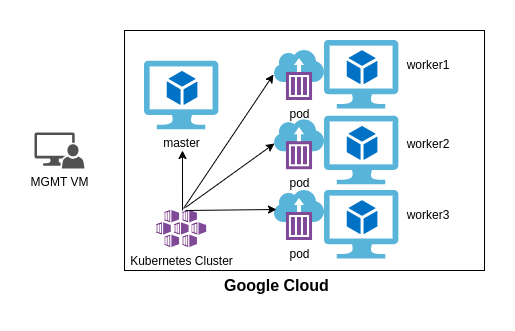
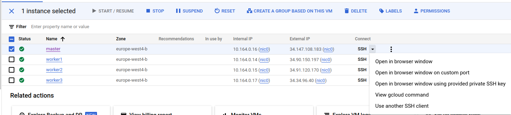

<a href="https://dei.tecnico.ulisboa.pt/"></a>

# [AGISIT 24/25](https://fenix.tecnico.ulisboa.pt/disciplinas/AGI11/2024-2025/1-semestre)

# Lab 4 - Deployment of a cloud-based infrastructure in a Self Hosted Kubernetes cluster

## Objectives

The result of this lab experiment will be a fully functioning Kubernetes cluster deployed on the cloud, and run a simple nginx deployment. You will follow the same steps as the last lab to start the virtual machines, and then use multiple ansible-playbooks which you should carefully analyze to set up the Kubernetes cluster and start the nginx deployment.
**Across the lab you will need to make certain changes to files for the deployment to work.**

## 1. Kubernetes

Kubernetes is an open-source platform for automating the deployment, scaling, and management of containerized applications. It orchestrates clusters of virtual or physical machines, ensuring that your applications run consistently across various environments. Kubernetes manages containers by scheduling them on nodes and automatically handling tasks like load balancing, scaling, and restarting failed containers. It’s widely used for managing microservices and cloud-native applications, providing resilience, flexibility, and ease of deployment in dynamic environments.

## 2. Architecture of Deployment

</a>

In the Kubernetes cluster, you will have 3 worker nodes and one master node. In Kubernetes, the master node hosts the Kubernetes control plane and manages the cluster, including scheduling and scaling applications and maintaining the state of the cluster. The worker nodes are responsible for running the containers and executing the workloads.

### 3. Provisioning the infrastructure
First start the mgmt box with *vagrant up*, you can reuse the same box as in lab. (Lab4 directory should be under /home/vagrant/labs/lab4) **If you are reusing the previous VM you can skip the step of creating a new key-pair**.

Or you can create a new one by deleting the previous one (*vagrant halt* and *vagrant destroy* inside lab3 directory) and running *vagrant up* inside this folder, when you are asked to choose a network device choose the one your machine uses to connect to the internet (most of the times eth0).


Then, login into gcloud:

    vagrant@mgmt:∼/gcpcloud$ gcloud auth login

    Go to the following link in your browser:

    https://accounts.google.com/o/oauth2/auth?redirect_uri=urn%3Aietf%3 Awg%3Aoauth%3A2.0%3Aoob&prompt=select_acco
    unt&response_type=code& client_id=......www.googleapis.com%2Fauth%2Faccounts.reauth& access_type=offline

    Enter verification code:

</a>


**Then follow these steps which are similar to 2-4 in lab3, to start the Infrastructure**

In this step-by-step approach, you will be able to create the infrastructure in the GCP. Go to the <span style="color:red">gcpcloud</span> folder, and there you have several <span style="color:red">.tf</span> files.

<span style="color:red">Please note: All the project files may contain "dummy" values for some variables, and so you MUST very carefully edit the relevant values, so that they are adequate to the project (even file paths may need to be modified...).</span>

Look into the ``terraform-gcp-variables.tf`` and ``terraform-gcp-provider.tf`` files and replace some of the TAGs with the field values corresponding to your project, as well as the name of the Credentials file from Google (note that you may have already there some dummy value that you need to replace).

Check *https://www.terraform.io/docs/providers/google/index.html* to find more information on how to configure these files.

The ``terraform-gcp-variables.tf`` defines variables that are used by other files. Edit this file and replace <span style="color:magenta">XXXXX</span> with the ID of your project (NOTE: this is not the name you gave to your project in the GCP Console. Select the project name at the top in the Google Cloud Console and retrieve the respective ID), for example:

    variable "GCP_PROJECT_ID" { 
        default = "agisit-2425-website-XXXXX-7657685"
    }

You also should check "machine type", in order to know which would be the "most affordable" for your budget. For that purpose, go to <span style="color:lightblue">*Compute Engine Pricing*</span> and look for N1 standard machine types, selecting the Region, for example Frankfurt (europe-west3), where you want to make the deployment. You should see there, for this project, that a ``n1-standard-1`` type is enough. Do not also forget to look at the Zones in <span style="color:lightblue">*GCP Zones*</span>.


With that step done, you can now initialize Terraform, in order to eventually satisfy some plugin requirements:

    vagrant@mgmt:∼/gcpcloud$ terraform init

As you can observe by studying the files ``terraform-gcp-servers.tf`` and ``terraform-gcp-networks.tf``, your infrastructure code is written (or, to be rigorous, the infrastructure is declared), by defining the desired resources and their characteristics.

You just need to make it live in the Google Cloud. Terraform “talks” to the Google Cloud APIs and makes sure that the planned infrastructure is always up-to-date with what you described in the code of the configuration files.

Before making it live, you are supposed to create a Plan, i.e., a process that compares your assumed **current state**, with the one declared in those configuration files, using API calls that fetch the current state from the Google Cloud Platform. Once you are happy with the Plan output, you Apply it, and if any changes are scheduled, they are actually performed.

Again as with lab2, you can verify that on the Management Node, in the **.ssh** directory (of the home user) there is no public RSA key. Let’s then create one key by running **ssh-keygen -t**, and specify the type of key we want to create, which will be RSA, and then tell how long a key we want with parameter -b. After that, verify that the keys have been created, by listing the contents of **.ssh**.

Please hit **ENTER** to the prompts, and do **not enter a password**.

```
~/tools$ ssh-keygen -t rsa -b 2048
Generating public/private rsa key pair.
Enter file in which to save the key (/home/vagrant/.ssh/id_rsa): 
Enter passphrase (empty for no passphrase): 
Enter same passphrase again: 
Your identification has been saved in /home/vagrant/.ssh/id_rsa
Your public key has been saved in /home/vagrant/.ssh/id_rsa.pub
The key fingerprint is:
SHA256:u9iXXb0ewuCU7u0/5XEfppgX+up9q5/8ZBmXgSMHD3E vagrant@mgmt
The key's randomart image is:
+---[RSA 2048]----+
|           +.E   |
|            = .  |
|           . = . |
|            + . o|
|        S  +   +.|
|         .+ o..+B|
|        .  =++++X|
|       o .+++oo*=|
|      . o..+=**B=|
+----[SHA256]-----+
```

You can now verify that in the **.ssh** directory (of the home user), there is a KEYPAIR of a public and private RSA key.

So, let’s go and create the Plan with the following command, resulting in a long list something similar to:

    vagrant@mgmt:∼/gcpcloud$ terraform plan


To execute the Plan and create the infrastructure, run Apply:

    vagrant@mgmt:∼/gcpcloud$ terraform apply

The output of Terraform can be viewed again with the command ``output``.

Once the command finishes, Terraform will create a new ``terraform.tfstate`` file. This file keeps the current state of the deployed infrastructure, and it is a 1:1 mapping of your deployed infrastructure, meaning that if you change/remove resources form the configuration files, they will be removed from your infrastructure and if you add/change resources to the configuration files, when you run the command Apply those changes will be reflected to the infrastructure.

Note the last lines of the apply command. They print out the public IP addresses of the instances created.

Please note: In case you receive errors similar to the following, then you may just need to select some other [GCP Zone](https://cloud.google.com/compute/docs/regions-zones). Change that in the ``terraform-gcp-variables.tf`` and Plan/Apply again.

    Error: Error waiting for instance to create: 

    The zone 'projects/agisit-2425-XXXXX/zones/europe-west3-c' does not have enough resources available to fulfill the request.  

    Try a different zone, or try again later.

Now that the infrastructure is (hopefully) created and deployed in Google Cloud Platform, in order for Ansible to access the machines and configure them, there is the need to populate the INVENTORY file, in this case named ``gcphosts``, present in the same project directory, as well as to edit the ``mgmt`` system ``/etc/hosts`` file with the IP addresses and names of the servers (retrieved from the output of ``‘terraform apply’``).


After analyzing, run the playbook *ansible-gcp-configure-nodes.yml*:

    ansible-playbook ansible-gcp-configure-nodes.yml


## 4. Installing Kubernetes

We now have to install Kubernetes on the nodes, analyze the *ansible-k8s-install.yml* and run it with:

    ansible-playbook ansible-k8s-install.yml


To install Kubernetes we must first install containerd. containerd is a high-level container runtime that is responsible for managing the complete lifecycle of containers. In the context of Kubernetes, containerd is used as the container runtime that interfaces with Kubernetes to handle container management tasks. This playbook then installs 3 three different things kubelet, kubeadm, and kubectl. 

kubelet is the primary agent that runs on every node (worker or master) in a Kubernetes cluster. Its job is to ensure that the containers described by pod specifications are running properly.

kubeadm is a tool that simplifies the process of setting up a Kubernetes cluster. It provides a simple way to initialize and join nodes to a cluster.

kubectl is the command-line tool used to interact with the Kubernetes cluster. It communicates with the Kubernetes API server to manage and inspect cluster resources.

To check if it was correctly installed, you need to ssh into the machine, to do this you have to go to Google Cloud > Compute Engine > VM instances > master > SSH > view gcloud command and copy the command as in the image below. **If it asks you to generate keys simply press ENTER.**



Then run:

    sudo kubectl version

Which should output:

```
Client Version: v1.28.14
Kustomize Version: v5.0.4-0.20230601165947-6ce0bf390ce3
```
**From here if there are problems with the playbooks try to understand why and fix them.**

## 5. Setting up the cluster

Leave the master machine with *exit*.
With Kubernetes installed in all nodes, we now have to set up the cluster. To this end analyze and run the *ansible-create-cluster.yml* with:

    ansible-playbook ansible-create-cluster.yml

For the pods inside the cluster to be able to communicate with each other we need to install a network plugin, we will use *Calico*. 

To check if the cluster was successfully created we need again go to the master node, follow the same steps as before to connect to it, and then run:

    sudo kubectl get nodes

Which should output:

```
NAME     STATUS   ROLES           AGE    VERSION
master   Ready    control-plane   2m6s   v1.28.14
```

In the end of this playbook we save the content of the *join-command* so the other machines can join the cluster.
Thus we run the *ansible-workers-join.yml* which runs the *join-command*, analyze and execute the following playbook:

    ansible-playbook ansible-workers-join.yml

Now run *sudo kubectl get nodes* on the master which should output a cluster with all nodes (after a few seconds):

```
NAME      STATUS   ROLES           AGE     VERSION
master    Ready    control-plane   2m54s   v1.28.14
worker1   Ready    <none>          18s     v1.28.14
worker2   Ready    <none>          17s     v1.28.14
worker3   Ready    <none>          17s     v1.28.14
```

## 6. Start a deployment. 
In this deployment we will deploy nginx, we deploy 4 instances, and expose the webserver at port 80.

With the cluster setup, we can now start our deployments with Kubernetes. Analyze the playbook as well as the *deployment.yaml* file, and then run the playbook with:

    ansible-playbook ansible-start-deployment.yml

In this *.yaml* we define a *kind* which specifies the type of Kubernetes resource you're creating. In this one, it defines a *Deployment*, which manages a set of pods ensures a specified number of replicas are running, and allows rolling updates to container images.

In *replicas* we choose the number of replicas that should be running at any time of the *app* called *nginx*.

In Kubernetes, a **pod** is the smallest and most basic deployable unit in Kubernetes. It represents a single instance of a running process in your cluster. A pod can contain one or more containers that share the same network namespace and storage, making it a fundamental building block for deploying applications in Kubernetes.

In *spec* (the second one), has the purpose of specifying the pod, including containers, images, ports, and other configurations for how the pod should run.

Then inside the *container* label we specify the name/image/exposed ports.

Run *sudo kubectl get pods* to check if the 3 pods were created you should see something similar to this:

```
NAME                                READY   STATUS    RESTARTS   AGE
nginx-deployment-86dcfdf4c6-f5czj   1/1     Running   0          17s
nginx-deployment-86dcfdf4c6-f5kgt   1/1     Running   0          17s
nginx-deployment-86dcfdf4c6-ktn8g   1/1     Running   0          17s
```

Run *sudo kubectl describe pods* and analyze the details.

## 7. Finish and Cleanup
To delete the Kubernetes deployment run the simple ansible playbook:
    
    ansible-playbook ansible-delete-deployment.yml

If you run 

    sudo kubectl get pods 

You should not see anything.

Finally, exit the master machine and run:

    terraform destroy

Beware of checking in the Google Cloud console to see if everything was deleted since you will need the funds later!